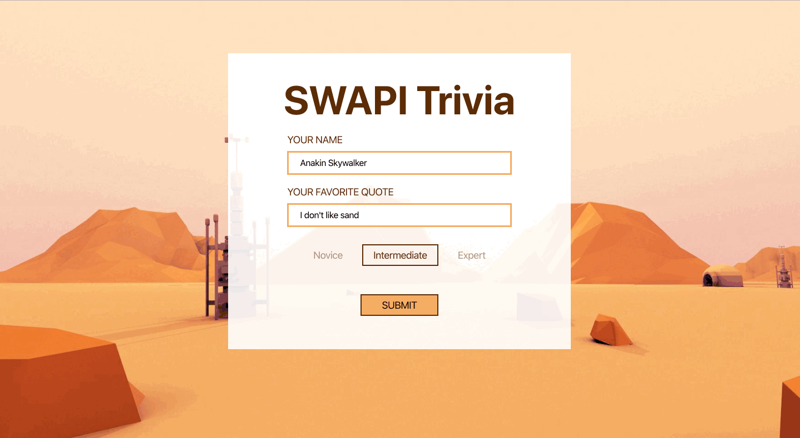
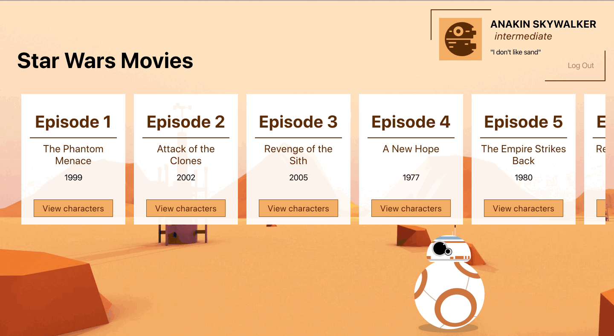
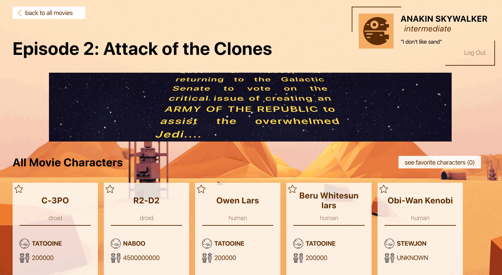
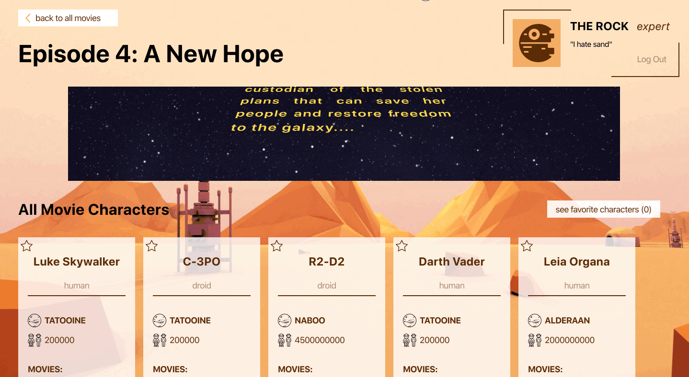
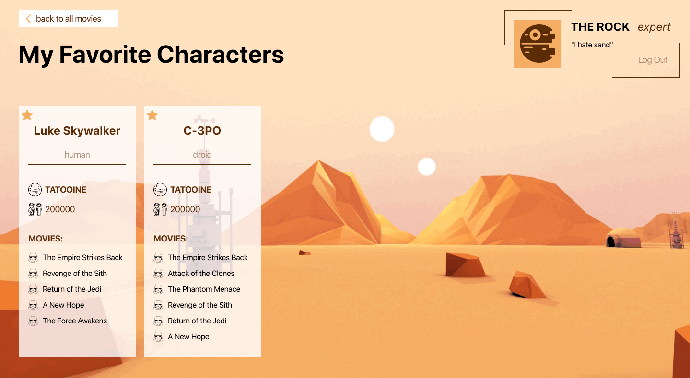
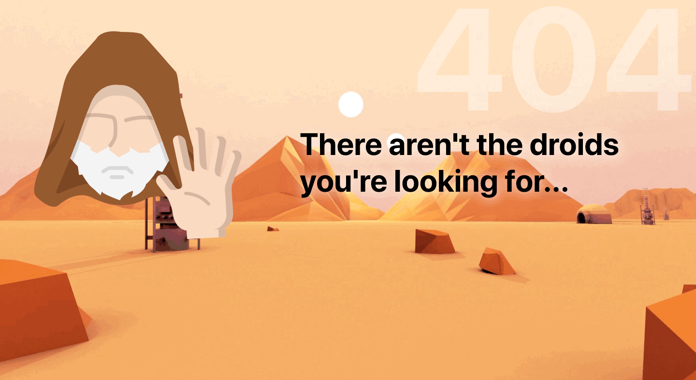

# SWAPI (Star Wars API)

## Group Members

Raisa Primerova and Allie McCarthy

## Overview 

SWAPI is an app that contains information about Star Wars movies and characters. 

### Set Up

Clone the repo. 
Run npm install to ensure all dependencies are running. 
Enter `npm start` in terminal to launch app.
Enjoy!

## Tech Stack

- HTML5
- CSS3
- JavaScript
- React
- Router

## Demo
Logging in:

Movie page:

Character page:

Favorites page:

Logging out:

Page 404:

## License
Note: All Star Wars images come from uihere.com and flaticon.com.

Much of the base CSS for BB-8 is credit to this Pen by Mike Dixon: https://codepen.io/mdixondesigns/pen/PPEJwz, which was the original inspiration for https://codepen.io/bullerb/pen/gMpxNZ by Brad Colthurst!

The R2D2 loading animation was taken from a Try Turing project

All credit goes to Turing School of Software for providing the project specifications and website design.
